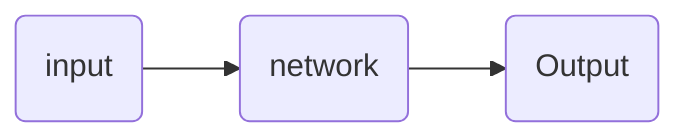

1. What is Neural Network?



1. Supervised Learning

Standard NN: 

Convolutional  NN:卷积循环网络，常用来处理image

Recurrent  NN :循环神经网络，处理一维序列化数据比如: video   ,语言等等


# Unit2 神经网络基础

向前传播和向后传播(利用梯度下降法)

基于逻辑回归logistic regression开始

几个公式:
$$
L = \hat ylog a+(1-\hat y)log(1-a) \\
\frac {\partial J(w,b)}{\partial z} = \hat y -a  \\
\frac {\partial J(w,b)}{\partial L}
$$

## 向量化计算(减少for 循环提高效率)

原理:(np采用了并行化计算)

```python
z= np.dot(W.T,x)+b
```

$$
z=w^Tx+b
$$

注:对b有广播机制,矩阵向量化同理,

### 关于激活函数选择:

> Sigmoid(z)   
$$g(z)=\frac1{1+e^{-z}},\overline {g(z)}=\frac{e^{-z}}{1+e^{-z}}$$
(注意：来自sigmoid 函数的输出值可以很容易地理解为概率。)
> 这个一般用不到，但是二元回归时比较好(比如区分是不是猫),其他情况性能比tanh差输出的值介于 0 和 1 之间，这使其成为二元分类的一个非常好的选择。 如果输出小于 0.5，则可以将其归类为 0，如果输出大于 0.5，则归类为 1。 它也可以用 tanh 来完成，但是它不太方便，因为输出在-1 和 1 之间。
2.ReLU(z)  $$g(z)=max(0,z)$$
一般不知道选什么选这个 (有一个对负半区进行修正的leaky Relu,通常表现更好但是没有在实践中运用)
(推荐)

>3.tanh(z) $$g(z)=\frac{e^{z}-e^{-z}}{e^{z}+e^{-z}}$$
>tanh激活函数通常比Sigmoid激活函数性能更好，因为其输出的平均值接近于零，因此在下一层，可以更好地集中数据。