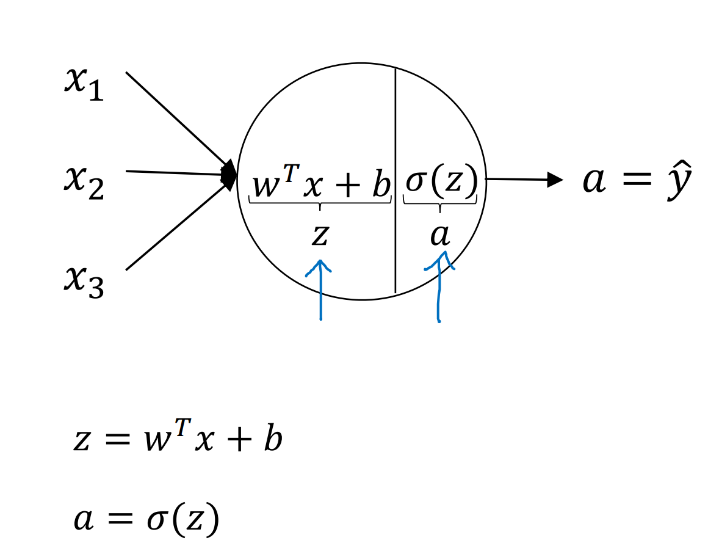
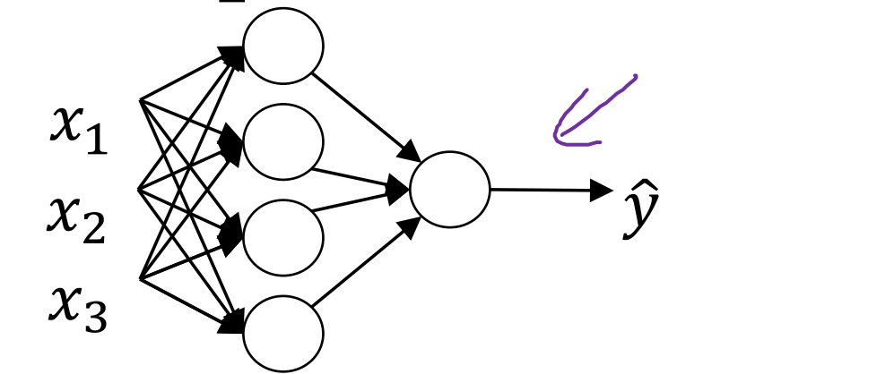
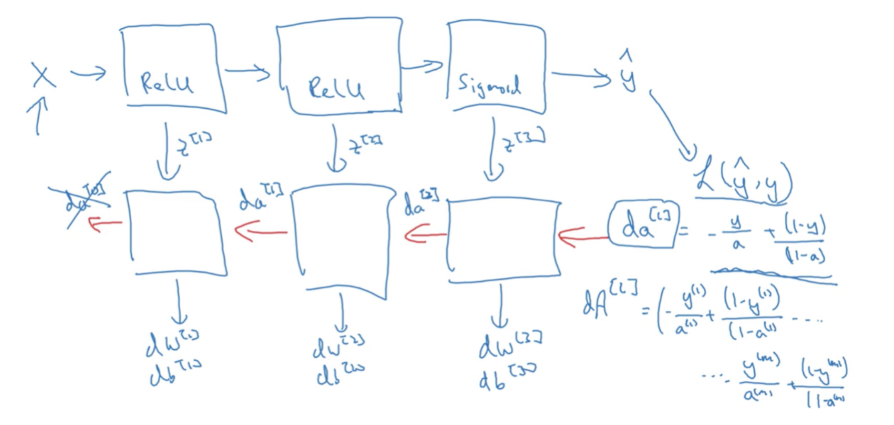

# Network Therom
## 向前传播forward propogation
这次笔记主要是对向前传播的过程以及数学公式进行梳理和整合
### 1. 单个神经元

x,w 是列向量$(x_{1\times 3})$,$\sigma$ 是激活函数，作用是使之非线性化，具体在另一篇notes[]中提到
### 2. 单层网络

为避免循环出现我们采用向量化方法,i.e
$$z = W^T x+b, a=g(z),\\
其中W=[w_1,w2,...w_{n_h}]$$
进一步的，由于我们有m组数据,故将z,x扩充成matrix,i.e
$$Z=[z_1,z_2...z_m],X=[x_1,x_2,...x_m]$$
### 3. 多层网络
$A(Z)^{[i]}_{nh_i\times m}表示第i层的数据，W^{T[i]}_{nh_i\times nh_{i-1}}是第i层的传输矩阵注意矩阵规格，则有$
$$Z^{[i]}=W^{T[i]}A^{[i-1]}+b^{[i]},A^i=g(Z^i)$$
传到最后一层A会退化成一个1xm的行向量，我们在计算J和L.

## Loss计算

## 反向传播
$dx记为\frac{\partial J}{\partial x},取损失函数L=-ylog\hat y-(1-y)log(1-\hat y),J=\frac{1}{m}\sum L(y,\hat y) ,a=g(z)为sigmoid函数时,g^{'}(z)=\frac{-e^{-z}}{(1+e^{-z})^2}=g(z)(1-g(z))=a-a^2,Relu函数,g^{'}(z)=1.$
$da^{[l]}=\frac1m\sum -\frac{y}{a}+\frac{1-y}{1-a}$
```py
da_l=1/m*np.sum(-y/a+(1-y)/(1-a))
```
$dz^{[l]}=da^{[l]}*\frac{\partial a}{\partial z}=a-a^2$
再向前传播
$da^{[n]}=dz^{[n+1]}\times W^{T[n+1]},dz^{[n]}=da^{[n]}\times\frac{\partial a}{\partial z},dw^{[n]}=dz^{[n+1]}\times a^{[n-1]},db^{[n]}=dz^{[n]}$
其中为了计算我们可以吧W,A存在cache中


## 梯度下降
upgrade:
主要是对参数W,b进行修正,其中$\alpha $为学习率
$$W=W-\alpha dW,b=b-\alpha db$$

