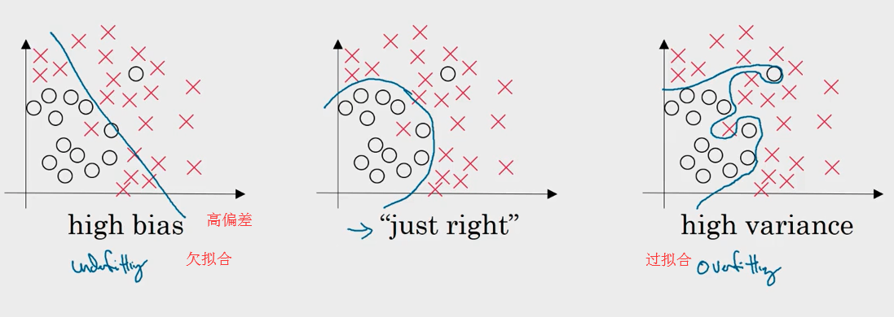
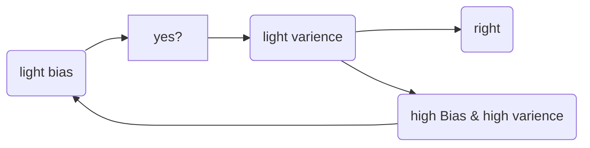
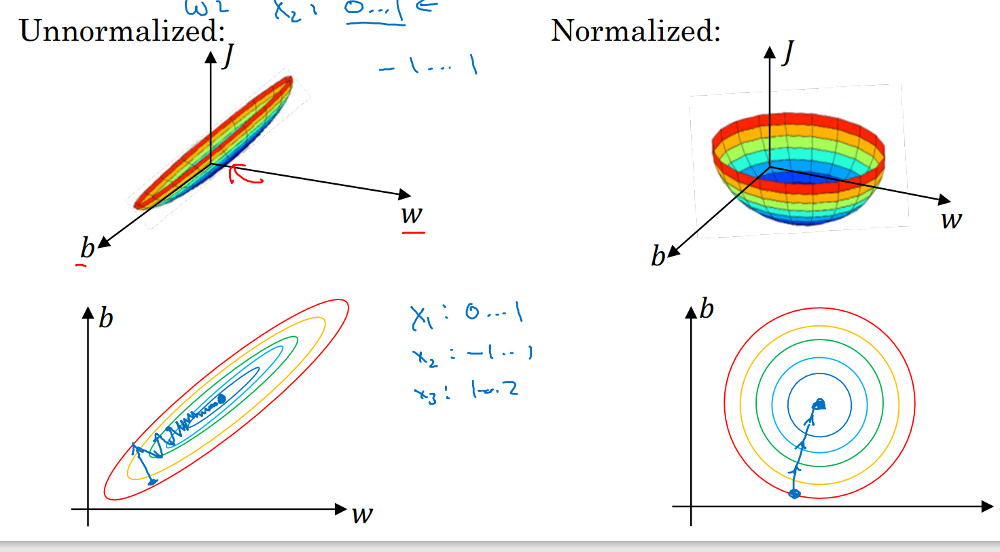

## Basic recipe for ML/DL(C2.U1)
#### Concept
1. **data set**
- training set 训练集
- Dev(elop) set 
- Test set  测试集
2. 欠拟合和过拟合 
    |欠拟合 | right|over过拟合 | 
    |---    |---   |--- |
    |error大,i.e Bias|      |方差varience大|  
  
* **From Bias to Varience**
  > Bias---->  training set 
  > Varience---->  Dev set 


改进过拟合:1.增加数据集(难！)
            (对于图片可以旋转裁剪扭曲等操作增加数据集,但可以减少数据获取，质量不如全新的图片，但方便)
            2.正则化

## Regularzation 正则化
target: **lower the overfitting**
1.**L1正则化**
使用L1正则化, w最终会是稀疏的(w中含很多0), 有利于压缩模型但也没有降低太多内存, 所以不能将压缩作为L1正则化的目的。通常我们使用**L2正则化**.
$$J(w, b) = \frac{1}{m} \sum^{m}_{i=1} \mathcal{L}(a^{(i)}, y^{(i)}) + \frac{\lambda}{2m} ||w||_1
$$
$其中||w||_1 = \sum^{n_x}_{j=1} |w_j|.$
2 .**L2正则化**
$$ J(w,b) = \frac{1}{m}\sum_{i=1}^{m} yloga+(1-y)log(1-a)  + \frac{\lambda}{2m}||w||^2 $$
$其中||w||^2_2 = \sum^{n_x}_{j=1} w_j^2 = w^Tw$,尽管$b$也是参数, 但我们没有必要添加 $\frac λ{2m}b$项，因为$w$几乎涵盖了所有参数, 而 b只是众多参数中的一个, 可以忽略不计(当然加上也没问题).
为什么加上一个$\frac{\lambda}{2m}||w||$ 会减少过拟合(overfitting)呢？直观上来说，当 $\lambda$较大时，迭代后||w||会变很小，因此某些神经元权重会变很小(甚至为0)，因此神经网络结构会变的简单(极端的话甚至趋于线性)。
3.**dropout 随机失活(权值衰减)**
广泛用于computer vision
缺点:难以保证J/L是否足够好,在调试与找参数时必要的关闭dropout
由于L2正则化失活往往会把权重集中在一个或是少数神经元上,导致拟合效果不佳

4 其他正则化
**数据扩增:**
比如训练分类猫咪的图片, 将图片左右翻转、旋转一个小角度、稍微变形处理等, 可以人工合成数据.
**Early Stopping:**
运行梯度下降时, 我们可以绘制训练误差, 当验证集误差不降反增的时候, 停止训练.
缺点：是可能导致代价J值不够小, 却又没解决继续训练可能导致的过拟合问题.(且不利于训练的优化)


### Code 
```py
def forward_propagation_with_dropout(X, parameters, keep_prob = 0.8):
    """
    X -- input dataset, of shape (input size, number of examples)
    parameters -- python dictionary containing your parameters "W1", "b1", "W2", "b2",...,"WL", "bL"
                    W -- weight matrix of shape (size of current layer, size of previous layer)
                    b -- bias vector of shape (size of current layer,1)
    keep_prob: probability of keeping a neuron active during drop-out, scalar
    :return:
    AL: the output of the last Layer(y_predict)
    caches: list, every element is a tuple:(W,b,z,A_pre)
    """
    np.random.seed(1)  #random seed
    L = len(parameters) // 2            # number of layer
    A = X
    caches = [(None,None,None,X,None)]  # 用于存储每一层的，w,b,z,A,D第0层w,b,z用none代替
    for l in range(1, L):
        A_pre = A
        W = parameters["W" + str(l)]
        b = parameters["b" + str(l)]
        z = np.dot(W, A_pre) + b  # 计算z = wx + b
        A = relu(z)  # relu activation function
        D = np.random.rand(A.shape[0], A.shape[1]) #initialize matrix D
        D = (D < keep_prob)       #convert entries of D to 0 or 1 (using keep_prob as the threshold)
        A = np.multiply(A, D)     #shut down some neurons of A
        A = A / keep_prob         # scale the value of neurons that haven't been shut down
        caches.append((W, b, z, A,D))
    # calculate Lth layer
    WL = parameters["W" + str(L)]
    bL = parameters["b" + str(L)]
    zL = np.dot(WL, A) + bL
    AL = sigmoid(zL)
    caches.append((WL, bL, zL, A))
    return AL, caches

def backward_propagation_with_dropout(AL, Y, caches, keep_prob = 0.8):
    """
        Implement the backward propagation presented in figure 2.
        Arguments:
        X -- input dataset, of shape (input size, number of examples)
        Y -- true "label" vector (containing 0 if cat, 1 if non-cat)
        caches -- caches output from forward_propagation(),(W,b,z,pre_A)
        keep_prob: probability of keeping a neuron active during drop-out, scalar
        Returns:
        gradients -- A dictionary with the gradients with respect to dW,db
        """
    m = Y.shape[1]
    L = len(caches) - 1
    # print("L:   " + str(L))
    # calculate the Lth layer gradients
    prev_AL = caches[L - 1][3]
    dzL = 1. / m * (AL - Y)
    dWL = np.dot(dzL, prev_AL.T)
    dbL = np.sum(dzL, axis=1, keepdims=True)
    gradients = {"dW" + str(L): dWL, "db" + str(L): dbL}
    # calculate from L-1 to 1 layer gradients
    for l in reversed(range(1, L)): # L-1,L-2,...,1
        post_W = caches[l + 1][0]  # 要用后一层的W
        dz = dzL  # 用后一层的dz
        dal = np.dot(post_W.T, dz)
        Dl = caches[l][4] #当前层的D
        dal = np.multiply(dal, Dl) #Apply mask Dl to shut down the same neurons as during the forward propagation
        dal = dal / keep_prob #Scale the value of neurons that haven't been shut down
        Al = caches[l][3]  #当前层的A
        dzl = np.multiply(dal, relu_backward(Al))#也可以用dzl=np.multiply(dal, np.int64(Al > 0))来实现
        prev_A = caches[l-1][3]  # 前一层的A
        dWl = np.dot(dzl, prev_A.T)
        dbl = np.sum(dzl, axis=1, keepdims=True)

        gradients["dW" + str(l)] = dWl
        gradients["db" + str(l)] = dbl
        dzL = dzl  # 更新dz
    return gradients    
```
> 注意：
> 1.训练时的 "a[l]/= 0.8" 要修复权重
> 2.在测试阶段无需使用 Dropout.(测试阶段要关掉)
> 3.Dropout 不能与梯度检验同时使用，因为 Dropout 在梯度下降上的代价函数J难以计算.
* 结果展示
Here are the results of our three models:

|model	|train accuracy|	test accuracy|
|---|---|---|
|3-layer NN without regularization	|95%|	91.5%|
|3-layer NN with L2-regularization	|94%|	93%|
|3-layer NN with dropout	|93%|	95%|

## 优化设置
* **归一化输入**
  $$ \overrightarrow x = x-\mu  , \overrightarrow x/=\sigma$$
  $$其中 \mu= \frac1m\sum x ,\sigma ^2=\frac1m x^2    $$
优化效果如下:
即使各维度尺寸保持相对一致便于调控搜索的步长
  

* **权值初始化**
 处理梯度消失&梯度爆炸
 ```py
W[l] = np.random.randn(shape)*np.sqrt(2/n[l-1])
\# 使用Relu作为激活函数,不同激活函数可查询资料/
 ```

## 梯度检测  
> ---only to debug, don't in training   
> 
  梯度估计:$f^{'}(x)=\frac{f(x+\epsilon)-f(x-\epsilon)}{2\epsilon}$,数值计算比单侧导数更精确.
1.1 gradient checking 如何工作?
Backpropagation 计算梯度(the gradients) $∂J,∂θ
,θ$代表着模型的参数，$J$是使用前向传播和你的loss function来计算的。前向传播十分容易，因此你使用计算$J$的代码来确认计算 $\frac{∂J}{∂θ}$的代码

我们来看一下derivative (or gradient)的定义：

$$\frac{∂J}{∂θ}=lim_{ε→0}\frac{J(θ+ε)−J(θ−ε)}{2ε}$$
接下来：
计算 "gradapprox" 使用公式（1）和 一个很小的值 ε
.遵循以下步骤:
$θ^+=θ+ε$
$θ^−=θ−ε$
$J^+=J(θ+)$
$J^−=J(θ−)$
$gradapprox=\frac{J^+−J^−}{2ε}$
然后，使用backward propagation计算gradient , 并存储结果到变量 "grad"
最后, 计算 "gradapprox" 和 the "grad" 的相对偏差，使用下列公式:
$$difference=\frac{||grad−gradapprox||_2}{||grad||_2+||gradapprox||_2}$$
你需要三个步骤来计算这个公式：
```py
#1'. compute the numerator(分子) 
 np.linalg.norm(...)
#2'. compute the denominator(分母). 
 np.linalg.norm(...) 
#3'. divide them.
```
如果这个 difference 非常小 (小于 $10^{−7}$), gradient计算正确. 否则，错误.
 ```py
 def gradient_check(x, theta, epsilon = 1e-7):
    """
    Implement the backward propagation presented in Figure 1.
    """
    
    # Compute gradapprox using left side of formula (1). epsilon is small enough, you don't need to worry about the limit.
    thetaplus = theta + epsilon
    thetaminus = theta - epsilon
    J_plus = forward_propagation(x, thetaplus)
    J_minus = forward_propagation(x, thetaminus)
    gradapprox = (J_plus - J_minus) / (2. * epsilon)

    # Check if gradapprox is close enough to the output of backward_propagation()
    grad = backward_propagation(x, theta)
    numerator = np.linalg.norm(grad - gradapprox)
    denominator = np.linalg.norm(grad) + np.linalg.norm(gradapprox)
    difference = numerator / denominator
    
    if difference < 1e-7:
        print ("The gradient is correct!")
    else:
        print ("The gradient is wrong!")
    
    return difference
 ``` 