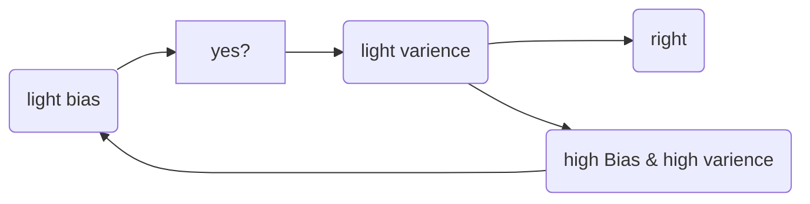

## Basic recipe for ML/DL
* **Concept**
           --- training set 训练集
  1.data set --- Dev(elop) set 
           --- Test set  测试集
    2.欠拟合和过拟合 
    |欠拟合 | right|over过拟合 | 
    |---    |---   |--- |
    |error大,i.e Bias|      |方差varience大|  
* **From Bias to Varience**
  > Bias---->  training set 
  > Varience---->  Dev set 


改进过拟合:1.增加数据集(难！)
            (对于图片可以旋转裁剪扭曲等操作增加数据集,但可以减少数据获取，质量不如全新的图片，但方便)
            2.正则化

## Regularzation 正则化
target: lower the overfitting
1 .L2正则化
$$ L = \frac{1}{m}\sum_{i=1}^{m?} yloga+(1-y)log(1-a)  + \frac{\lambda}{2m}||w|| $$
为什么加上一个$\frac{\lambda}{2m}||w||$ 会减少过拟合(overfitting)呢？直观上来说，当 $\lambda$较大时，迭代后||w||会变很小，因此某些神经元权重会变很小(甚至为0)，因此神经网络结构会变的简单(极端的话甚至趋于线性)。
类似的有L1正则化，只是改成取一次范数即可
2.dropout 随机失活(权值衰减)
广泛用于computer vision
缺点:难以保证J/L是否足够好,在调试与找参数时必要的关闭dropout
由于L2正则化失活往往会把权重集中在一个或是少数神经元上,导致拟合效果不佳

3.过早中止法
画出training set和dev set中L随iteration次数的曲线并提前在合适的点结束迭代
(但是不利于训练的优化)

Here are the results of our three models:

|model	|train accuracy|	test accuracy|
|---|---|---|
|3-layer NN without regularization	|95%|	91.5%|
|3-layer NN with L2-regularization	|94%|	93%|
|3-layer NN with dropout	|93%|	95%|

## 优化设置
* 归一化输入
  $$ \overrightarrow x = x-\mu  , \overrightarrow x/=\sigma$$
  $$其中 \mu= \frac1m\sum x ,\sigma ^2=\frac1m x^2    $$
优化效果如下:
即使各维度尺寸保持相对一致便于调控搜索的步长
  

* 权值初始化
 处理梯度消失&梯度爆炸
 ```py
W[l] = np.random.randn(shape)*np.sqrt(2/n[l-1])
\# 使用Relu作为激活函数,不同激活函数可查询资料/
 ```

* 梯度检测  
> ---only to debug, don't in training   
  梯度估计:$f^{'}(x)=\frac{f(x+\epsilon)-f(x-\epsilon)}{2\epsilon}$,数值计算比单侧导数更精确.

  