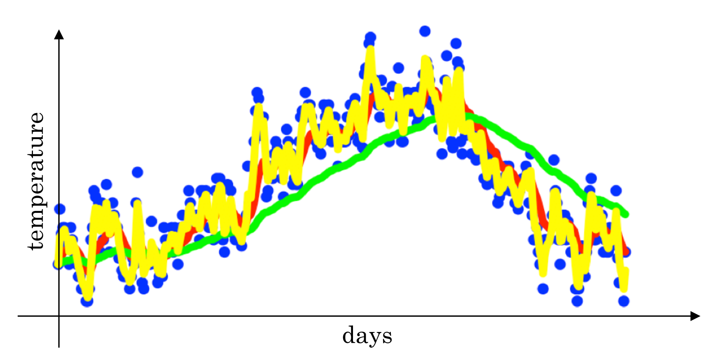
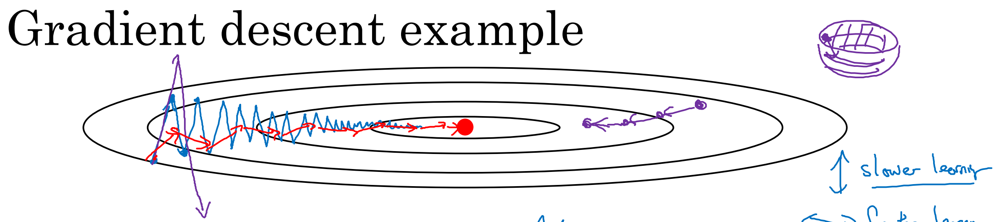
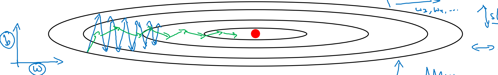

## 优化方法(C2.U2)

### 1. 梯度优化算法

#### 1.1 Mini-batch 梯度下降

将 $X=[x(1),x(2),x(3),...,x(m)]$矩阵所有 m个样本划分为 t个子训练集,每个子训练集，也叫做mini-batch；每个子训练集称为 $x^{\{i\}}$, 每个子训练集内样本个数均相同(若每个子训练集有1000个样本, 则 $x^{\{i\}}=[x(1),x(2),...,x(1000)]$,维度为 (nx,1000).

例：把x(1)到x(1000)称为 X{1}, 把x(1001)到x(2000)称为 X{2}，如果你的训练样本一共有500万个，每个mini-batch都有1000个样本，也就是说，你有5000个mini-batch, 因为5000*1000=500万， 最后得到的是 X{5000}.

若m不能被子训练集样本数整除, 则最后一个子训练集样本可以小于其他子训练集样本数。 Y亦然.

训练时, 每次迭代仅对一个子训练集（mini-batch）进行梯度下降:
```py
On iteration t:
    Repeat:For i=1,2,...,t:
    Forward Prop On X{i}
    Compute Cost J{i}
    Back Prop using X{i},Y{i}
    Update w,b
```
1.使用 batch 梯度下降法时：

一次遍历训练集只能让你做一个梯度下降；每次迭代都遍历整个训练集,预期每次迭代成本都会下降

2.但若使用 mini-batch 梯度下降法

一次遍历训练集，能让你做5000个梯度下降；如果想多次遍历训练集，你还需要另外设置一个while循环...

若对成本函数作图, 并不是每次迭代都下降, 噪声较大, 但整体上走势还是朝下的.
特别的当minibatch的size很小，几乎是随机梯度下降，噪声较大，最后甚至不会收敛于最小值，但一般会在附近摆动.
>1)若样本集较小(小于2000), 无需使用 mini-batch;
>
> 2)一般的 mini-batch 大小为 64~512, 通常为 2 的整数次方(这样代码运行可能更快).
>

一般的mini-batch GD还会加上Stochastic Gradient Descent(随机梯度下降的方法，即先随机打乱样本再训练)
具体代码见[HWC2-2](./../source/HWC2-2.ipynb)

#### 1.2 指数加权平均数(Exponentially Weighted Averages)
[参考博客](https://zhuanlan.zhihu.com/p/68748778)
> 这个不是优化算法，是下面的优化方法的数学基础.
> 
> 指数移动平均EMA（Exponential Moving Average）也叫权重移动平均（Weighted Moving Average），是一种给予近期数据更高权重的平均方法。
> * 普通平均数$\overline{v} =\frac1n\sum^n_{i=1}\theta_i$
> * EMA :$v_t =\beta v_{t-1}+(1=\beta)\theta_t$，
> 
> $v_t$表示前t条的平均值($v_0=0$)，$\beta$是加权权重值 (一般设为0.9-0.999)。

$$v_t=βv_t−1+(1−β)θ_t,β∈[0,1)$$

Andrew Ng在Course 2 Improving Deep Neural Networks中讲到，EMA可以近似看成过去$\frac{1}{1-\beta}$个时刻v值的平均。

普通的过去 n时刻的平均是这样的：$v_t=\frac{(n-1)v_{t-1}+\theta_t}{n}$,

类比EMA，可以发现当 $\beta =\frac{n-1}{n}$时，两式形式上相等。需要注意的是，两个平均并不是严格相等的，这里只是为了帮助理解。

实际上，EMA计算时，过去$\frac{1}{1-\beta}$个时刻之前的数值平均会decay到$\frac{1}{e}$的加权比例，证明如下。

如果将这里的$v_t$展开，可以得到：
 
$$
v_t=\alpha^n v_{t-n}+(1-\alpha)\left(\alpha^{n-1} \theta_{t-n+1}+\ldots+\alpha^0 \theta_t\right)
$$
其中,$n=\frac{1}{1-\beta}$带入可得$\alpha ^n=\alpha ^{\frac{1}{1-\alpha }}=\frac{1}{e}$

**在深度学习的优化中的EMA**

上面讲的是广义的ema定义和计算方法，特别的，在深度学习的优化过程中， $\theta _t$是t时刻的模型权重weights，$v_t$是t时刻的影子权重（shadow weights）。

在梯度下降的过程中，会一直维护着这个影子权重，但是这个影子权重并不会参与训练。基本的假设是，模型权重在最后的n步内，会在实际的最优点处抖动，所以我们取最后n步的平均，能使得模型更加的鲁棒。

**EMA的偏差修正**

实际使用中，如果令 $v_0=0$，且步数较少，EMA的计算结果会有一定偏差。因此可以加一个偏差修正（bias correction）：
$$v_t= \frac{v_t}{1+\beta^t}$$
显然，当t很大时，修正近似于1。

#### 1.3 动量梯度下降法(Gradient Descent With Momentum)

真实训练可能会出现这样的情况:
1. 摆动向最小值前进，效率低
2. 如果学习率较大直接超调(跳出凸区域)只能使用小学习率

动量梯度下降法(Momentum) 使用指数加权平均数EMA(计算梯度的指数加权平均数,并用该梯度更新你的权重,于是更平滑，可以用更大的学习率):
```py
# β一般为0.9
for iteration t:
    ##... compute dW,db
    v_dW=β*v_dW+(1−β)*dW,
    v_db=β*v_db+(1−β)*db
    W=W−α*v_dW
    b=b−α*v_db
```
#### 1.4 RMSprop(Root Mean Square prop)

全称是均方根传递，能够很好的消除两方向不协调摆动，从而可以提高学习率.
```py

# β参数与EMA方法不同，一般为0.999
for iteration t:
    ##... compute dW,db
    SdW=β2*SdW+(1−β2)*(dW)^2
    Sdb=β2*Sdb+(1−β2)*(db)^2
    W=W−α*dW/sqrt(SdW)+epsilon  # 分母+epsilon是为了数值稳定性，通常取10^-8
    b=b−α*db/sqrt(Sdb)+epsilon
```

#### 1.5 Adam 优化算法(Adaptive Moment Estimation)

RMSprop 与 Adam 是少有的经受住人们考验的两种算法.
Adam 的本质就是将 Momentum 和 RMSprop 结合在一起. 使用该算法首先需要初始化:
$$ v_{dW} = 0, S_{dW} = 0, v_{db} = 0, S_{db} = 0.$$
在第t次迭代中:
$$\begin{aligned}
v_{dW}  = \beta_1 v_{dW} + (1 - \beta_1)dW ,
v_{db}  = \beta_1 v_{db} + (1 - \beta_1)db \\
S_{dW}  = \beta_2 S_{dW} + (1 - \beta_2)(dW)^2 ,\   
S_{db}  = \beta_2 S_{db} + (1 - \beta_2)(db)^2 \\
v_{dW}^{\text{corrected}}  = \frac{v_{dW}}{1-\beta_1^t}, \quad
v_{db}^{\text{corrected}} = \frac{v_{db}}{1-\beta_1^t} \\
S_{dW}^{\text{corrected}}  = \frac{S_{dW}}{1-\beta_2^t}, \quad
S_{db}^{\text{corrected}} = \frac{S_{db}}{1-\beta_2^t} \\
W  = W - \alpha\frac{v_{dW}^{\text{corrected}}}{\sqrt{S_{dW}^{\text{corrected}}+\varepsilon}} ,
b  = b - \alpha\frac{v_{db}^{\text{corrected}}}{\sqrt{S_{db}^{\text{corrected}}+\varepsilon}}
\end{aligned}
$$
|超参数 |值|
|---|---|
|$β$|$0.9$|
|$β_2$|$0.999$|
|$\epsilon$|$10^{-8}$|
|$\alpha$|调整|

### 2. 超参数调整优化

#### 2.1 学习率衰减(Learning Rate Decay)

如果使用固定的学习率 α, 在使用 mini-batch 时在最后的迭代过程中会有噪音, 不会精确收敛, 最终一直在附近摆动. 因此我们希望在训练后期 α不断减小.

以下为几个常见的方法:

**法一：**
$$α=\frac{α_0}{decay\_rate∗epoch\_num}$$
其中 α0为初始学习率; epoch_num为当前迭代的代数; decay_rate是衰减率, 一个需要调整的超参数.

**法二：**
$$α=0.95^{epoch\_num}α_0$$
其中 0.95 自然也能是一些其他的小于 1 的数字.

**法三：**

$$α=\frac{k}{\sqrt{epoch\_num}}α_0$$

**法四:**

离散下降(discrete stair cease), 过一阵子学习率减半, 过一会又减半.
$$\alpha = \frac{1}{1 + decayRate \times \lfloor\frac{epochNum}{timeInterval}\rfloor} \alpha_{0}$$

**法五:**

手动衰减, 感觉慢了就调快点, 感觉快了就调慢点.?

### 3. 局部最优问题(Local Optima)

人们经常担心算法困在局部最优点, 而事实上算法更经常被困在鞍点, 尤其是在高维空间中

成熟的优化算法如 Adam 算法，能够加快速度，让你尽早往下走出平稳段.